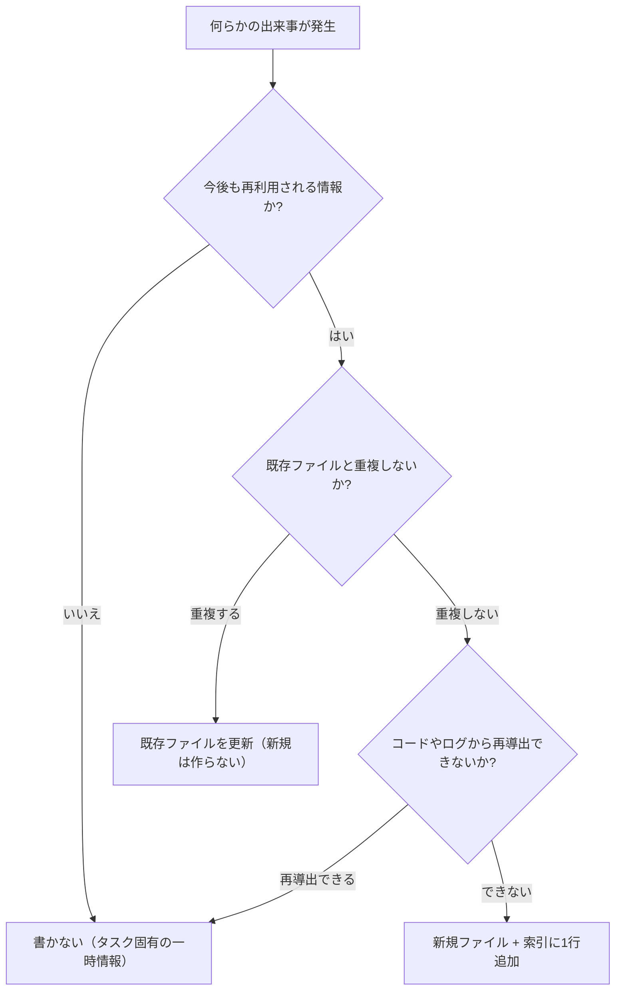

これは[16媒体に自動配信するコンテンツ基盤の全体アーキテクチャ](https://zenn.dev/mameresearcher/articles/ai-agent-multi-channel-content-ops)の深掘りシリーズの1本です。[前回](https://zenn.dev/mameresearcher/articles/ai-agent-persistent-memory-ssot)は「索引+詳細ファイルに分けた永続知識層」という設計思想を書きました。今回はその続きとして、**実際にどんなファイル形式で、どんな判定基準で運用しているか**を、抽象化せずに書き下します。

前回の記事は「考え方」でした。今回は「実装」です。運用中の実測値と、実際に踏んだ失敗も含めて書きます。

:::message
初版は設計テンプレートの提示に留まっており「実装と言いながらコードも実測値もない」という指摘を受けました。実際に運用しているコード、トークン実測値、ベクタDBとの比較、踏んだ失敗を追記して全面的に書き直しています。
:::

## まず結論: この設計の存在理由は「トークン予算」

先に一番大事な数字を出します。現在運用中の知識層の実測値です。

| 項目 | 実測値 |
|---|---|
| 詳細ファイル数 | **214件** |
| 詳細ファイル合計 | 935KB / **584,398字** |
| 1ファイルのサイズ | 中央値 3,435B / 平均 4,474B / 最大 18,605B |
| 索引(1ファイル) | 13,262字 |
| **索引が全体に占める比率** | **2.3%** |

トークンに換算すると、日本語主体なので概算で:

- 全部コンテキストに載せる = **584k〜759k tok**
- 索引だけ載せる = **13k〜17k tok**

つまり**2.3%のコストで、58万字の知識体に「何があるか」を把握できる**。これがこの設計の全てです。逆に言えば、知識量がこの規模に達しないなら、この設計は過剰です。ファイル30件くらいなら全部読ませたほうが速いし確実です。

「索引を200行で切る」というハード制限も、感覚ではなくここから逆算しています。1行あたり平均90字前後なので、200行 ≒ 18,000字 ≒ 18k〜23k tok。**セッション開始時の固定コストとして許容できる上限をこのあたりに置いている**、という理屈です。

## なぜベクタDBではなくプレーンなファイルなのか

ここが最初に聞かれる点だと思うので、先に書きます。RAG構成(埋め込み + ベクタ検索)にしなかった理由は3つあります。

### 1. 「何があるか全部わかっている」状態を作りたかった

ベクタ検索は**クエリに似たものを上位k件返す**仕組みです。これは「大量の文書から関連箇所を引く」用途には最適ですが、今回欲しかったのは違いました。

欲しかったのは「**この作業に関係する知識が存在するかどうかを、漏れなく判断できる**」状態です。索引を丸ごとコンテキストに載せてしまえば、判断はモデルのattentionが担当します。埋め込みの類似度がたまたま低くて拾えなかった、という取りこぼしが原理的に起きません。

214件・58万字という規模は、**索引化すれば全件を視野に入れられる境界内**にありました。これが10万件なら成立しません。規模がこの設計を許している、という順序です。

### 2. 意味的に「近い」ことが役に立たない知識が多い

知識の内訳は実測でこうなっています。

| 分類 | 件数 |
|---|---|
| reference(恒久的なやり方・参照先) | 94 |
| feedback(方針・訂正) | 78 |
| project(進行中の事実) | 42 |

このうち `feedback` は「過去に訂正されたルール」です。これは**意味的な近さでは引けません**。「PowerShellでpythonを呼ぶときの標準出力エンコーディング」という知識が必要になる場面は、文面上まったく似ていない別の作業中に突然来ます。似ているかどうかではなく「そういうルールが存在することを知っているか」が効くタイプの知識です。

### 3. git diff が読めること、人間が直接直せること

これは地味ですが実運用では大きいです。全てプレーンテキストなので:

- `git diff` で「エージェントが何を覚えたか」がレビューできる
- 間違った記憶を人間が直接エディタで消せる
- 検索が `grep` で済む
- インフラがゼロ(ベクタDBの運用・再インデックス・埋め込みコストが要らない)

**トレードオフとして、意味検索は完全に捨てています。** 「金額の話が書かれたファイル」のような曖昧な引き方はできません。索引のフックに書いてある語で引っかからなければ見つかりません。そこは割り切りです。

## 詳細ファイルのフォーマット: 4フィールドで固定する

詳細ファイル1件は、必ず次の4フィールドを持つ小さなテキストファイルにしています。

```yaml
---
name: {ファイル名と対応するスラグ}
description: {何についてのファイルか。索引に出す1行サマリと同一}
metadata:
  type: reference | feedback | project
---

{本文: 事実 + なぜ + どう使うか}
```

ポイントは**`description`を索引の1行とファイル内フロントマターの両方で共有する**ことです。索引側だけ別に文章を書くと、時間が経つにつれて「索引の説明」と「ファイルの中身」がズレていきます。

### 実際のファイル

テンプレートだけ見せても伝わらないので、実物に近い形で出します。`feedback` 分類の1件です。

```markdown
---
name: feedback_ps1_python_stdout_encoding_pitfall
description: PowerShellからpython子プロセスを呼ぶとき OutputEncoding 未設定で
             日本語が化ける。UTF8指定が必須
metadata:
  type: feedback
---

PowerShell から python を子プロセスとして呼ぶ場合、
`$OutputEncoding` と `[Console]::OutputEncoding` の両方を UTF8 にしないと、
python 側が UTF-8 で出した日本語が受け側で壊れる。

**理由**: Windows PowerShell 5.1 の既定 OutputEncoding が UTF-8 ではないため、
python の stdout が UTF-8 でも受け側のデコードが破綻する。
実際にレポート生成が全面文字化けし、原因特定に時間を取られた。

**適用場面**: ps1 から python を呼ぶスクリプトを新規に書くとき。
`$env:PYTHONIOENCODING = "utf-8"` も併せて設定する。
```

短いです。中央値3,435Bというのはこのくらいの分量です。**1ファイル1事実**を守ると自然にこのサイズに収まります。

## 分類ごとの本文テンプレート

分類ごとに**本文の書き方そのものを変えている**のが具体化のポイントです。

### reference: 恒久的なやり方 — 「手順・トラップ + 発見の経緯」

```
{癖・トラップ・手順}

**発見の経緯**: {どういう失敗/検証でこれが分かったか}
```

最も長寿命な分類です(実測でも94件と最多)。コードのバグではなく「環境やツールの構造的な癖」を書くため、月単位・年単位で有効です。

「発見の経緯」を書くのは、後から**「この癖はまだ生きているか」を検証できるようにする**ためです。経緯がないと、古い記述を消すべきか残すべきか判断できません。

### feedback: 方針・訂正 — 「ルール + 理由 + 適用条件」

```
{ルールそのものを1行で}

**理由**: {なぜそのルールが必要になったか。多くは過去の失敗や強い訂正}
**適用場面**: {いつ、どんな場面でこのルールを思い出すべきか}
```

**理由を必ず書く**のが一番重要です。ルールだけ書くと、似ているが微妙に違う場面に遭遇したときに適用すべきか判断できません。「なぜ」があれば、エッジケースでも「この理由に当てはまるか」で判断できます。

### project: 進行中の事実 — 「事実 + 理由 + 効いてくる場面」

feedbackとテンプレートは似ていますが、**性質が違います**。feedbackは恒久ルール、projectは今のプロジェクト状態です。同じ構造でも、**この事実は1〜2ヶ月で腐るという前提で扱う**かどうかが分かれ目になります。

### 参照先だけのファイル: ポインタのみ、内容は書かない

```
{何の情報がどこにあるか。1〜2行}
```

意図的に薄く書きます。参照先の実体は変わり続けるので、ここに詳細を書くと真っ先に陳腐化します。

## 索引の実装

### 1行フォーマット

```
- [{タイトル}]({ファイルパス}) — {60〜150字のフック}
```

このフックは**「なぜ重要か」ではなく「これを見た瞬間に思い出すべき最短の手がかり」**を書きます。重要度の説明ではなく検索性を優先する、ということです。

### 読み込みと注入

索引はセッション開始時に丸ごとシステムプロンプト側へ入れます。実装は素朴です。

```python
import sys
from pathlib import Path

MEM_DIR = Path.home() / ".agent" / "memory"
INDEX = MEM_DIR / "MEMORY.md"
INDEX_MAX_CHARS = 20_000   # ≒ 20k〜26k tok を固定コストの上限とする


def load_index() -> str:
    if not INDEX.exists():
        return ""
    txt = INDEX.read_text(encoding="utf-8")
    if len(txt) > INDEX_MAX_CHARS:
        # 上限超過は「切り詰め」ではなく警告して人間に判断させる。
        # 機械的に末尾を落とすと、古いが重要なエントリが黙って消える。
        print(f"[warn] index {len(txt)}字 > 上限 {INDEX_MAX_CHARS}字 — 棚卸しが必要",
              file=sys.stderr)
    return txt


def load_detail(slug: str) -> str | None:
    p = MEM_DIR / f"{slug}.md"
    return p.read_text(encoding="utf-8") if p.exists() else None
```

ここで一点だけ設計判断があります。**上限を超えたときに自動で切り詰めない**ことです。自動truncateは楽ですが、「古いが決定的に重要なルール」が黙って落ちます。落ちたことに気づけないのが最悪なので、警告を出して棚卸しを人間に投げる方針にしています。

## 書き込みタイミングの判定フロー

「ユーザーの訂正時と想定外事実の判明時に書く」だけでは足りず、実際にはもう一段フィルタが挟まっています。



この中で一番効果が大きかったのが**Q1「今後も再利用されるか」で一度フィルタする**ことでした。

これを入れる前は、その場限りの作業メモまで永続層に書いてしまい、索引がすぐに肥大化していました。**「これは半年後の別セッションでも役に立つか」を毎回問うだけ**で、書き込み量が目に見えて減り、残ったものの質が上がりました。

Q3も地味に効きます。「このファイルはこの関数を呼んでいる」のような、コードを読めば分かる情報を書かないためのフィルタです。書いた瞬間から二重管理になり、リファクタで即座に嘘になります。

## 実際に踏んだ失敗: 「スナップショット」を舐めると誤情報の生産源になる

ここが今回いちばん書きたかった部分です。前回「知識層の記述は書いた瞬間のスナップショットに過ぎない」と書きましたが、これを**実際に舐めて痛い目に遭いました**。

### 失敗1: 古い数値が「事実」として何日も流通した

週次レポートを生成する運用で、あるチャネルの実績値(投稿数・表示回数)が外部GUIからしか取れず、取得に失敗した週は「前回値を継続使用」という運用にしていました。そのこと自体は記録してありました。

問題は、**その「前回値」が知識層に書かれた瞬間から、後続のセッションで検証されずに引き継がれ続けた**ことです。数日後に実データを取り直したところ、実際の累計値は記録の約2倍でした。つまりレポートは何日も過少な数字を「実績」として載せ続けていたことになります。

書いた時点では正しかった。ただ**「継続使用」というラベルが付いていても、次のセッションはそれを既定値として扱ってしまう**。これがスナップショット問題の実際の顕れ方でした。

対策として、`project` 分類の数値には「いつ時点の値か」を本文に必ず書き、レポート生成側では**継続使用値に明示的なマーカーを付けて、更新されない限り注意書きが残る**ようにしました。

### 失敗2: 「対策を書き足したら悪化した」

これはもっと厄介なパターンでした。

あるパイプラインが失敗し続けたので、原因と対策を知識層に書きました。ところが対策として書き足した一文が、**別の判断を狂わせる副作用**を持っていました。結果として、修正後の方が失敗率が上がりました。

「知識を追加すれば改善する」は自明ではない、ということです。**書き足した内容が既存の判断とどう干渉するか**まで見ないと、知識層は逆向きに働きます。以降、`feedback` を追記するときは「この一文が他のどの判断に効くか」を1回考える手順を挟んでいます。

### 失敗3: ファイルパスの記述が黙って腐る

`reference` に「〇〇という機能は `path/to/file.py` にある」と書いていたものが、リネーム後も残っていました。参照した時点では検証していないので、存在しないパスを前提に作業を進めてしまいます。

**ファイルパスや関数名は、リネーム・削除で最も簡単に食い違う情報**です。そして「参照時に現物確認する」という一手間は、まさに省略したくなる種類の手間です。ここを飛ばした瞬間に、永続層は「誤情報の生産源」に転落します。

現在は、知識層由来の記述でファイル・関数・フラグの存在を前提にする場合、**行動に移す前に実物を確認する**ことを運用ルールとして明文化しています。

## この設計が向かないケース

正直に書いておきます。

- **知識が数十件規模** → 索引を作る意味がない。全部読ませたほうが速く確実
- **意味的な曖昧検索が主用途** → ベクタ検索のほうが適切。索引方式は語が一致しないと引けない
- **複数人で並行編集** → ファイルベースはコンフリクトする。DBのほうが素直
- **知識が数万件規模** → 索引自体がコンテキストに載らなくなり前提が崩れる

裏を返すと、**「数百件規模・単一の書き手・取りこぼしを許容できない」という条件が揃ったときにだけ**、この設計はうまく機能します。

## まとめ

- 索引方式の存在理由は**トークン予算**。実測で索引13,262字(全体の2.3%)から58万字の知識体に到達できる。この比率が成立する規模でのみ有効
- ベクタDBを選ばなかったのは「取りこぼしを原理的に起こしたくない」「意味的な近さが役に立たない知識(過去の訂正など)が多い」「git diffでレビューでき人間が直せる」の3点。**意味検索は捨てている**
- 詳細ファイルは4フィールド固定、`description` は索引と共有して二重管理を避ける。1ファイル1事実で中央値3.4KBに収まる
- 分類ごとにテンプレートを分け、**恒久ルールと一時的な事実を「書き方のレベルで」区別する**
- 書き込み前に「再利用性 → 重複 → 再導出可能性」の3段フィルタ。効果が最大なのは1段目
- 索引の上限超過は**自動truncateしない**。黙って重要な記述が落ちるほうが害が大きい
- **スナップショット問題は概念ではなく実害として来る**。古い数値が事実として流通し、書き足した対策が副作用で悪化し、ファイルパスが黙って腐る。行動前の現物確認を運用ルールにするしかない

設計思想は移植しやすい一方、実装まで踏み込まないと「結局どう書けばいいか」で毎回迷います。逆に実装だけ真似しても、規模と用途が合っていないと機能しません。**自分の知識量と、意味検索が必要かどうかを先に確認する**のがおすすめです。
