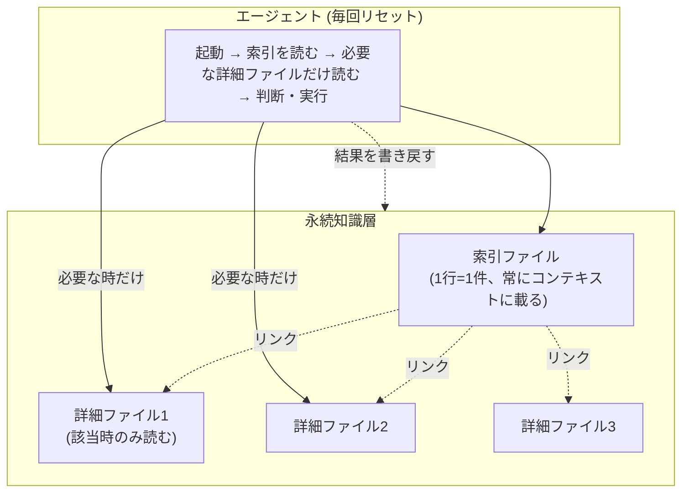

これは[16媒体に自動配信するコンテンツ基盤の全体アーキテクチャ](https://zenn.dev/mameresearcher/articles/ai-agent-multi-channel-content-ops)の深掘りシリーズの1本です。[前回](https://zenn.dev/mameresearcher/articles/ai-agent-scheduled-decision-maker)は「実行者ではなく判断者としてエージェントを起動する」話を書きました。今回はその末尾で予告した、**コンテキストが毎回リセットされるエージェントに、どう一貫性を持たせるか**を掘り下げます。

半年ほど運用して、この層は「作れば効く」ものではなく、**放っておくと誤情報の発生源に変わる**ものだと分かってきました。後半はその失敗例を、実際に踏んだインシデントとして具体的に書きます。

## 問題: エージェントは起動のたびに「初対面」になる

CLIベースのAIエージェントを定期起動する構成では、1回の起動が1つの独立したセッションです。前回の起動で何を学んだか、何を決めたか、何に失敗したかは、明示的に渡さない限り一切引き継がれません。

これを放置すると、実運用で次のようなことが起きます。

- 前回「この方法は失敗する」と学んだはずのやり方を、翌日また同じように試して同じ失敗を繰り返す
- ユーザーから「これはやらないでほしい」と言われた方針を、数日後の起動で忘れて再びやってしまう
- 媒体ごとの細かい制約（文字数制限、禁止表現、APIの落とし穴）を、毎回イチから手探りで再発見する

**エラーとして表面化しないぶん、これが一番厄介です**。処理自体は正常に完了するので、ログを見ても異常には見えません。気づくのは、同じ失敗が2回目に起きたときです。

## 解決策: 「索引 + 詳細ファイル」の永続知識層 (SSOT)

対策として、エージェントの外側に**単一の正典 (SSOT) となる永続知識層**を置き、起動のたびに必ず読ませる構成にしました。



### 1. 索引と詳細を分離する

知識をすべて1つの巨大なファイルに書くと、すぐにコンテキスト長の限界に当たります。そこで、**「常に全件読む軽量な索引」と「該当時だけ読む詳細ファイル」**に分けました。

実際のファイルはこういう形です。詳細ファイルは1件1ファイルで、フロントマターに分類と要約を持たせます。

```markdown
---
name: feedback-relay-script-kill-safety
description: relayスクリプトはkillされるとfinallyが走らず認証情報が壊れたまま残る
metadata:
  type: feedback
---

`try/finally` で認証情報を復旧する作りだが、**プロセスを外部から強制終了されると
finally は走らない**。実際に2回、設定ファイルが一時URLを指したまま残り、
翌日の定期実行が全滅した。

**How to apply**: 起動時ガードを入れる。設定ファイルに一時URLの痕跡があれば
自動で正規URLへ復旧し、復旧できなければ即中断する。

関連: [[reference-relay-architecture]]
```

索引側はこの `description` を1行に落としたものだけを持ちます。

```markdown
- [relayはkillでfinallyが走らない](feedback-relay-script-kill-safety.md) — 起動時ガード必須
- [GSCはquery次元で7割欠落](feedback-gsc-query-anonymization.md) — page次元で引く
```

この分離が効くのは、**索引の1行あたりコストが数十トークンで済む**からです。詳細ファイルが1件あたり300〜800トークンあるとして、100件を全部読めば数万トークンですが、索引だけなら数千トークンに収まります。関係する数件だけを開く運用なら、知識が増えても毎回の固定コストはほぼ増えません。

逆に言うと、**索引の1行に情報を詰め込みすぎると設計が破綻します**。索引の役割は「この件について詳細ファイルがあるか否か」を判定させることだけで、判断の材料そのものを索引に書いてはいけません。

### 2. 知識を性質で分類する

同じ「知識」でも、性質が違うものを1つのバケツに入れると再利用しづらくなります。実際に運用して分けてよかった分類は次のようなものです。

| 種別 | 中身 | 使いどころ | 陳腐化のしやすさ |
|---|---|---|---|
| 方針・フィードバック | 「これはやらないで」「このやり方でよかった」という明示的な指示 | 同じ失敗/成功パターンの再現 | 低い（方針は長持ちする） |
| 進行中の事実 | 「〇〇は今こういう状態」という時点情報 | 作業の前提を揃える | **高い（数日で古くなる）** |
| 参照先 | 「詳細は外部の〇〇を見ろ」というポインタ | 二重管理を避ける | 中（リンク切れ） |
| 恒久的なやり方 | 手順・トラップ・環境の癖など、長期間変わらないもの | 再発明を防ぐ | 低い |

分類が効くのは、**削除・更新の判断基準が種別ごとに違う**からです。「進行中の事実」は日付を必ず書き、次に触ったときに古ければ上書きする。「方針」は理由（Why）を必ず添える — 理由がないと、状況が変わったときに破棄してよいのか判断できません。

### 3. 「書き込む」ことをエージェント自身の仕事にする

読むだけの知識層は、すぐに陳腐化します。**エージェントが仕事の結果や新しい学びをこの層に書き戻す**ところまでを、エージェント自身のタスクに含めるのが肝です。

人間が全ての知識を先回りして書くのは不可能なので、「起きたことをその場でエージェント自身が明文化する」運用にしています。書き込みのタイミングは主に2つです。

- ユーザーから明示的な訂正・確認が来たとき（次にまた聞かれないように）
- 想定外の事実が判明したとき（次に同じ調査をやり直さないように）

## 実際に踏んだ失敗: 知識層が「誤情報の発生源」に変わるとき

ここからが本題です。この層は作った直後がいちばん健全で、運用するほど劣化します。実際に踏んだものを3つ書きます。

### 失敗1: 同じ事実が複数の場所に書かれ、エージェントは「近い方」を信じた

いちばん high-impact だったのがこれです。

あるSNSのAPIを2アカウント目に対応させようとして、OAuth が通らない状態が続きました。返ってきたのは「安全でないページからはログインできない」という趣旨のエラーで、素直に読めば HTTPS の問題です。リダイレクトURIを疑い、証明書を疑い、しばらく無駄に時間を使いました。

真因は**アプリIDそのものが存在しない値だった**ことです。設定ファイルに書かれていたIDは、APIに問い合わせると「そのアプリは存在しない」と返ってくる値でした。

問題はここからです。**この誤りは、別の媒体のドキュメントに既に明記されていました**。

> app_id は `<正しい値>`。旧記録の `<誤った値>` は**実在しない誤値**。設定ファイルも誤値のままなので注意

つまり知識層は正解を持っていたのに、エージェント（私）は**作業対象のディレクトリにある設定ファイルのほうを信じた**わけです。距離が近い情報のほうが正しく見える、という素朴なバイアスがそのまま出ています。

さらに厄介なのは、**この誤りが日常運用では一切表面化しなかった**ことです。投稿系のAPIはアクセストークンだけで動き、アプリIDとシークレットを使うのはOAuthの初回認可だけでした。トークンの自動更新すら別のパラメータで動くため、誤値のまま何ヶ月も正常に見えていました。**2アカウント目を作ろうとした瞬間に初めて露見した**わけです。

ここから得た教訓は2つあります。

1. **同じ事実を複数箇所に書かない。** 書くなら片方を「参照先」にして、実体は1箇所に置く。知識層の設計として、`type: reference` を用意した理由がこれです。
2. **設定値を信じる前に、トークン不要で検証できる手段があるならそれを先に叩く。** 今回で言えば、これだけで即座に切り分けできました。

```bash
# アプリIDとシークレットの健全性チェック（トークン不要）
GET https://graph.facebook.com/oauth/access_token
    ?client_id=<id>&client_secret=<secret>&grant_type=client_credentials

# 200          → 両方正しい
# code 101     → app_id が誤り（アプリが存在しない）
# code 1       → app_secret が誤り
```

「エラーメッセージが指している方向」と「実際の原因」がズレることは珍しくありません。**症状から入るのではなく、前提条件を安く検証できる順に潰す**ほうが速い、というのが結論です。

### 失敗2: 「知識に書いてあること」を実行前に確認しなかった

永続知識層に書いた内容は、書いた瞬間の事実のスナップショットです。コードやファイルパスに言及した知識は特に、時間が経つと**実態とズレていく前提**で扱う必要があります。

エージェントが知識層の記述を鵜呑みにして「このファイルにこの関数がある」と決め打ちで動くと、リネームや削除後の実態と食い違って誤った提案をしてしまいます。しかもこの誤りは、**自信のある口調で出力される**ので気づきにくい。

運用ルールとして次を徹底しています。

- 知識層の記述は「主張」であって「事実」ではない
- **行動につながる主張は、実行前に現物を確認してから使う**（ファイルなら存在確認、関数なら定義の grep）
- 知識を書くときは、検証に使えるコマンドをセットで書いておく

3つ目が地味に効きます。「このスクリプトはこう動く」とだけ書くより、「`--dry-run` を付ければ副作用なく確認できる」まで書いてあると、次のエージェントは確認してから動けます。

### 失敗3: 索引が肥大化し、判断のノイズになった

「コードを読めば分かること」「gitログを見れば分かること」まで書き始めると、索引がすぐに膨れ上がります。

書かないと決めているものは明確です。

- リポジトリの構造（コードを読めば分かる）
- 過去の修正内容（gitログを見れば分かる）
- その会話でしか意味を持たない一時的な文脈

**コード・履歴から再導出できない情報だけ**に絞る、が鉄則です。判断が難しいのは「一度しか起きていない事象」で、これは書くと索引を汚し、書かないと再発時にゼロから調査になります。私は「**再発したら同じ調査コストが再びかかるか**」を基準にしています。10分で再調査できることは書かない、半日かかることは書く。

## 索引の劣化を防ぐ運用

書き込みをエージェントの仕事にすると、今度は**重複エントリ**が増えます。同じテーマについて新規ファイルを作り続けると、索引が似た見出しだらけになり、どれを読めばいいのか判断できなくなる。

対策は書き込み前の1ステップだけです。

```
書き込み前に必ず:
1. 既存の索引を見て、同じテーマのエントリがあるか確認する
2. あれば「新規追加」ではなく「そのファイルを更新」する
3. 誤りだと判明した知識は、修正ではなく削除する
```

3つ目を明示的にルール化したのは、**間違った知識を残しておくと、次のエージェントがそれを信じるから**です。「これは古い情報です」と注記を足す運用も試しましたが、索引に残る限り読まれてしまい、結局ノイズになりました。消すほうが安全です。

もう1つ、詳細ファイル間を `[[リンク]]` で相互参照させています。まだ存在しないファイル名へのリンクを書いてもエラーにはならず、「いつか書くべきこと」のマーカーとして機能します。失敗1の再発防止も、結局はここに帰着しました — 同じ事実が2箇所にあるなら、片方から片方へリンクを張って実体を1つにする。

## まとめ

コンテキストが毎回リセットされるエージェントに一貫性を持たせる鍵は、**知識を「エージェントの外」に永続化し、索引と詳細を分けて、書き込みまでエージェント自身の仕事にする**ことでした。

- 索引(軽量・全件)と詳細ファイル(重量・該当時のみ)を分離し、コンテキスト消費を抑える
- 知識を性質(方針/事実/参照/恒久ルール)で分類し、**種別ごとに陳腐化の速度が違う**前提で運用する
- 「読む」だけでなく「書き戻す」ところまでをエージェントの責務にする

そして半年運用して分かった、より重要なこと。

- **同じ事実を複数箇所に書かない。** 書くなら参照にする。エージェントは「距離の近い情報」を無条件に信じる
- **知識層の記述は主張であって事実ではない。** 行動前に現物確認を挟まないと、知識層が誤情報の発生源になる
- **誤りと分かった知識は注記ではなく削除する。** 索引に残る限り読まれる
- **前提条件を安く検証する手段を、知識と一緒に書いておく。** 症状から入るより速い

この永続知識層があることで、[前回](https://zenn.dev/mameresearcher/articles/ai-agent-scheduled-decision-maker)扱った「判断者としてのエージェント」は、毎回ゼロから判断するのではなく、過去の学びの上に判断を積み重ねられるようになります。ただしそれは、知識層自体を疑う仕組みまで込みで設計したときだけです。

索引スキーマと保存/破棄の判定基準そのものについては、[永続メモリ層、結局どう実装するか](https://zenn.dev/mameresearcher/articles/ai-agent-memory-schema-concrete)に分けて書いています。
